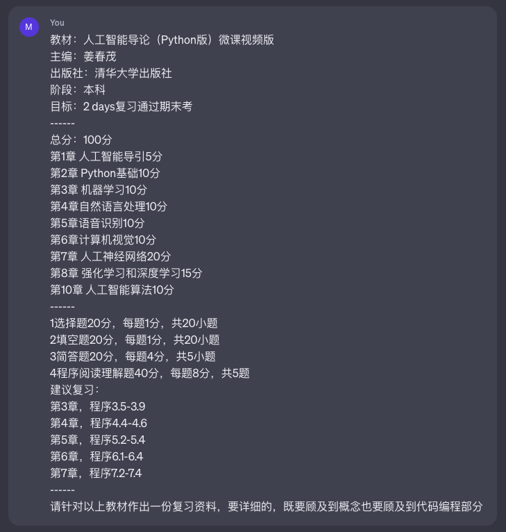

当然，我会为你提供一份更详细的复习资料，对每章的概念进行详细解析。以下是每章的内容：

第1章 人工智能导引（5分）
- 人工智能的定义：人工智能是研究、设计和开发用于模拟、延伸和扩展人的智能的理论、方法、技术和应用系统的科学。
- 人工智能的发展历史：介绍人工智能的起源、发展阶段和里程碑事件。
- 人工智能的主要任务：包括知识表示与推理、问题解决、学习与自适应、感知与理解、交互与对话等任务。
- 人工智能的应用领域：涵盖自然语言处理、计算机视觉、机器学习、语音识别、智能机器人等领域。

第2章 Python基础（10分）
- Python的基本语法：介绍Python的变量、数据类型、运算符、条件语句、循环语句等基本语法要点。
- 控制流程和函数定义：讲解条件语句（if-else语句）、循环语句（for循环、while循环）、函数定义和调用的用法和注意事项。
- 列表、字典和文件操作：详细介绍列表（list）和字典（dictionary）数据结构的使用方法，以及文件的读取和写入操作。
- 模块和包的使用：介绍Python中模块和包的概念，以及如何导入和使用现有的模块和包。

第3章 机器学习（10分）
- 机器学习的基本概念：介绍机器学习的定义、分类、主要任务和流程。
- 监督学习、无监督学习和强化学习：详细解释监督学习、无监督学习和强化学习的原理、应用场景和算法。
- 线性回归、逻辑回归和决策树：讲解线性回归、逻辑回归和决策树算法的基本原理、优缺点和应用领域。
- 神经网络和深度学习简介：介绍神经网络的基本结构和深度学习的概念，包括前馈神经网络和反向传播算法。

第4章 自然语言处理（10分）
- 自然语言处理的基本任务和挑战：讲解自然语言处理中的文本分词、词性标注、句法分析、语义分析等任务，以及处理长尾

词、歧义性等挑战。
- 文本预处理和特征提取：介绍文本预处理过程中的去噪、标准化、分词等步骤，以及特征提取方法如词袋模型和TF-IDF。
- 文本分类和情感分析：解释文本分类的方法和常见的分类算法，以及情感分析的基本原理和应用。
- 语言模型和机器翻译简介：讲解语言模型的建模方法，以及机器翻译的基本原理和流程。

第5章 语音识别（10分）
- 语音信号处理的基本概念：介绍语音信号的特点、采样和量化方法，以及时域和频域的基本分析方法。
- 语音特征提取和预处理：详细解释语音信号的特征提取方法，如MFCC特征、梅尔频谱等，以及预处理步骤如语音端点检测。
- 隐马尔可夫模型（HMM）和高斯混合模型（GMM）：讲解HMM和GMM在语音识别中的应用，包括语音识别的基本原理和流程。
- 声学模型和语言模型：介绍声学模型和语言模型在语音识别中的作用和建模方法。

第6章 计算机视觉（10分）
- 计算机视觉的基本任务和挑战：解释计算机视觉中的图像分类、目标检测、图像分割等任务，以及数据集、光照、视角变化等挑战。
- 图像特征提取和表示方法：讲解图像特征提取的常用方法，如颜色直方图、SIFT特征、深度学习特征等，以及图像表示方法。
- 图像分类和目标检测：详细解释图像分类和目标检测的算法原理，包括传统方法如SVM和深度学习方法如卷积神经网络（CNN）。
- 图像生成模型：介绍图像生成模型的基本概念和常见方法，如生成对抗网络（GAN）和变分自编码器（VAE）。

第7章 人工神经网络（20分）
- 人工神经元和神经网络的基本结构：解释人工神经元的工作原理和神经网络的组成部分，包括输入层、隐藏层、输出层等。
- 前馈神经网络和反向传播算法：详细介绍前馈神经网络的原理和训练过程，以及反向传播算法的推导

和应用。
- 深度神经网络和卷积神经网络：讲解深度神经网络的概念和训练方法，以及卷积神经网络在计算机视觉中的应用。
- 循环神经网络（RNN）和长短期记忆网络（LSTM）：介绍循环神经网络的结构和应用，以及LSTM网络在序列建模中的优点。

第8章 强化学习和深度学习（15分）
- 强化学习的基本概念和要素：解释强化学习中的智能体、环境、状态、动作、奖励等基本概念。
- Q-learning算法和价值函数：讲解Q-learning算法的原理和价值函数的定义，以及如何通过迭代更新来学习最优策略。
- 深度强化学习和深度Q网络（DQN）：详细介绍深度强化学习的概念和DQN算法的原理，以及经验回放和目标网络的重要性。
- 策略梯度方法和Actor-Critic算法：讲解策略梯度方法的基本思想和算法，以及Actor-Critic算法的原理和优势。

第10章 人工智能算法（10分）
- 遗传算法和模拟退火算法：解释遗传算法和模拟退火算法的基本原理和应用领域。
- 蚁群算法和粒子群算法：详细介绍蚁群算法和粒子群算法的概念、行为规则和优化过程。
- 混合智能算法和多目标优化：讲解混合智能算法的特点和多目标优化的问题定义和解决方法。

希望这份详细的复习资料能帮助你更好地理解每章的概念和算法，并顺利通过期末考试。如有需要，请随时提问。祝你好运！